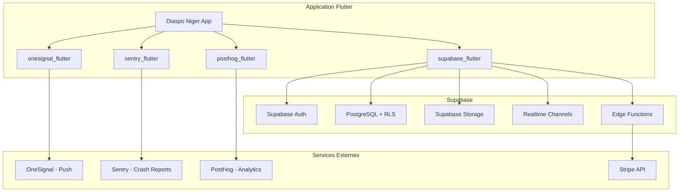
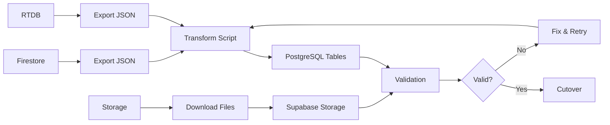
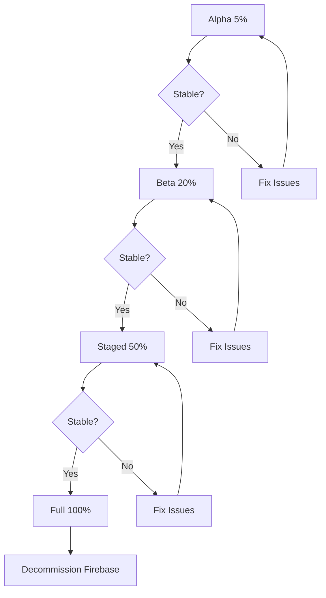

# Plan de Migration Firebase vers Supabase
## Application Diaspo Niger

---

## Comparaison des Approches

| Critere | Approche Progressive (Recommandee) | Approche Big Bang |
|---------|-----------------------------------|-------------------|
| **Risque** | Faible (rollback facile) | Eleve |
| **Complexite** | Elevee (dual-write) | Moyenne |
| **Temps d'arret** | Minimal | Fenetre de maintenance requise |
| **Duree totale** | 16-20 semaines | 5-8 semaines |
| **Rollback** | Feature flags instantanes | Restauration complete |

**Recommandation** : Approche progressive avec feature flags pour minimiser les risques sur une application en production avec 30+ collections et des fonctionnalites critiques (paiements, messaging).

---

## Architecture Cible



---

## Phase 1 : Preparation et Infrastructure

### 1.1 Configuration Supabase

**Fichiers a creer :**
```
supabase/
├── config.toml
├── migrations/
│   ├── 00001_initial_schema.sql
│   ├── 00002_rls_policies.sql
│   ├── 00003_triggers.sql
│   └── 00004_seed_data.sql
├── functions/
│   ├── _shared/
│   │   ├── supabase-client.ts
│   │   ├── stripe-client.ts
│   │   └── onesignal-client.ts
│   ├── send-notification/
│   ├── stripe-webhook/
│   ├── on-message-created/
│   └── process-payment/
└── seed.sql
```

**Configuration Flutter :**
```
lib/
├── core/
│   ├── config/
│   │   └── supabase_config.dart       # Nouveau
│   ├── services/
│   │   ├── supabase_service.dart      # Nouveau (singleton)
│   │   └── ...
│   └── constants/
│       └── supabase_tables.dart       # Remplace firebase_collections.dart
```

### 1.2 Dependances pubspec.yaml

**A supprimer :**
```yaml
# Firebase (a retirer progressivement)
firebase_core: ^4.4.0
firebase_auth: ^6.1.4
cloud_firestore: ^6.1.2
firebase_storage: ^13.0.6
firebase_messaging: ^16.1.1
firebase_app_check: ^0.4.1+4
cloud_functions: ^6.0.6
firebase_analytics:
firebase_crashlytics:
firebase_performance:
firebase_database: ^12.1.3
firebase_remote_config: ^6.1.4
```

**A ajouter :**
```yaml
# Supabase
supabase_flutter: ^2.5.0

# Notifications Push
onesignal_flutter: ^5.2.0

# Crash Reporting
sentry_flutter: ^8.0.0

# Analytics
posthog_flutter: ^4.5.0
```

---

## Phase 2 : Schema PostgreSQL

### 2.1 Tables Principales

```sql
-- =========================================================================
-- EXTENSIONS
-- =========================================================================
CREATE EXTENSION IF NOT EXISTS "uuid-ossp";
CREATE EXTENSION IF NOT EXISTS "postgis";

-- =========================================================================
-- ENUMS
-- =========================================================================
CREATE TYPE admin_role AS ENUM ('superAdmin', 'contentMod', 'businessMod', 'financeMod');
CREATE TYPE friend_request_status AS ENUM ('pending', 'accepted', 'declined', 'cancelled');
CREATE TYPE group_request_status AS ENUM ('pending', 'approved', 'rejected', 'cancelled');
CREATE TYPE order_status AS ENUM ('pending', 'paid', 'shipped', 'delivered', 'completed', 'cancelled');
CREATE TYPE transaction_status AS ENUM ('pending', 'completed', 'failed', 'cancelled');
CREATE TYPE call_status AS ENUM ('ringing', 'answered', 'ended', 'missed', 'declined');
CREATE TYPE message_type AS ENUM ('text', 'image', 'video', 'audio', 'document', 'call', 'location');

-- =========================================================================
-- TABLE DE MAPPING FIREBASE (OBLIGATOIRE)
-- =========================================================================
CREATE TABLE firebase_user_mapping (
    firebase_uid TEXT PRIMARY KEY,
    supabase_user_id UUID UNIQUE NOT NULL REFERENCES auth.users(id),
    email TEXT,
    migrated_at TIMESTAMPTZ DEFAULT NOW()
);

-- =========================================================================
-- UTILISATEURS ET PROFILS
-- =========================================================================
CREATE TABLE profiles (
    id UUID PRIMARY KEY REFERENCES auth.users(id) ON DELETE CASCADE,
    firebase_uid TEXT UNIQUE,  -- Pour compatibilite migration
    email TEXT UNIQUE NOT NULL,
    display_name TEXT NOT NULL,
    photo_url TEXT,
    bio TEXT,
    phone_number TEXT,
    country TEXT,
    city TEXT,
    date_of_birth DATE,
    gender TEXT,
    profession TEXT,
    languages TEXT[],
    interests TEXT[],
    is_online BOOLEAN DEFAULT FALSE,
    last_seen TIMESTAMPTZ,
    is_verified BOOLEAN DEFAULT FALSE,
    admin_role admin_role,
    is_admin BOOLEAN DEFAULT FALSE,  -- Legacy
    fcm_token TEXT,  -- Devient OneSignal player_id
    onesignal_player_id TEXT,
    created_at TIMESTAMPTZ DEFAULT NOW(),
    updated_at TIMESTAMPTZ DEFAULT NOW()
);

CREATE TABLE blocked_users (
    id UUID PRIMARY KEY DEFAULT uuid_generate_v4(),
    user_id UUID NOT NULL REFERENCES profiles(id) ON DELETE CASCADE,
    blocked_user_id UUID NOT NULL REFERENCES profiles(id) ON DELETE CASCADE,
    created_at TIMESTAMPTZ DEFAULT NOW(),
    UNIQUE(user_id, blocked_user_id)
);

-- =========================================================================
-- AMIS
-- =========================================================================
CREATE TABLE friends (
    id UUID PRIMARY KEY DEFAULT uuid_generate_v4(),
    user_id UUID NOT NULL REFERENCES profiles(id) ON DELETE CASCADE,
    friend_id UUID NOT NULL REFERENCES profiles(id) ON DELETE CASCADE,
    created_at TIMESTAMPTZ DEFAULT NOW(),
    UNIQUE(user_id, friend_id)
);

CREATE TABLE friend_requests (
    id UUID PRIMARY KEY DEFAULT uuid_generate_v4(),
    sender_id UUID NOT NULL REFERENCES profiles(id) ON DELETE CASCADE,
    receiver_id UUID NOT NULL REFERENCES profiles(id) ON DELETE CASCADE,
    status friend_request_status DEFAULT 'pending',
    created_at TIMESTAMPTZ DEFAULT NOW(),
    updated_at TIMESTAMPTZ DEFAULT NOW()
);

-- =========================================================================
-- CONVERSATIONS ET MESSAGES
-- =========================================================================
CREATE TABLE conversations (
    id UUID PRIMARY KEY DEFAULT uuid_generate_v4(),
    firebase_id TEXT UNIQUE,  -- Pour compatibilite migration
    created_by UUID REFERENCES profiles(id),
    is_group BOOLEAN DEFAULT FALSE,
    group_name TEXT,
    group_photo_url TEXT,
    last_message_text TEXT,
    last_message_at TIMESTAMPTZ,
    last_message_sender_id UUID REFERENCES profiles(id),
    created_at TIMESTAMPTZ DEFAULT NOW(),
    updated_at TIMESTAMPTZ DEFAULT NOW()
);

CREATE TABLE conversation_members (
    id UUID PRIMARY KEY DEFAULT uuid_generate_v4(),
    conversation_id UUID NOT NULL REFERENCES conversations(id) ON DELETE CASCADE,
    user_id UUID NOT NULL REFERENCES profiles(id) ON DELETE CASCADE,
    joined_at TIMESTAMPTZ DEFAULT NOW(),
    last_read_at TIMESTAMPTZ,
    unread_count INTEGER DEFAULT 0,
    is_muted BOOLEAN DEFAULT FALSE,
    is_pinned BOOLEAN DEFAULT FALSE,
    UNIQUE(conversation_id, user_id)
);

CREATE TABLE messages (
    id UUID PRIMARY KEY DEFAULT uuid_generate_v4(),
    firebase_id TEXT UNIQUE,
    conversation_id UUID NOT NULL REFERENCES conversations(id) ON DELETE CASCADE,
    sender_id UUID NOT NULL REFERENCES profiles(id),
    message_type message_type DEFAULT 'text',
    content TEXT,
    media_url TEXT,
    media_thumbnail_url TEXT,
    media_duration INTEGER,  -- Pour audio/video en secondes
    media_size INTEGER,
    reply_to_id UUID REFERENCES messages(id),
    is_forwarded BOOLEAN DEFAULT FALSE,
    forwarded_from_id UUID REFERENCES messages(id),
    is_edited BOOLEAN DEFAULT FALSE,
    edited_at TIMESTAMPTZ,
    is_deleted BOOLEAN DEFAULT FALSE,
    deleted_at TIMESTAMPTZ,
    metadata JSONB,  -- Donnees additionnelles flexibles
    created_at TIMESTAMPTZ DEFAULT NOW()
);

CREATE TABLE message_reads (
    id UUID PRIMARY KEY DEFAULT uuid_generate_v4(),
    message_id UUID NOT NULL REFERENCES messages(id) ON DELETE CASCADE,
    user_id UUID NOT NULL REFERENCES profiles(id) ON DELETE CASCADE,
    read_at TIMESTAMPTZ DEFAULT NOW(),
    UNIQUE(message_id, user_id)
);

-- =========================================================================
-- GROUPES
-- =========================================================================
CREATE TABLE groups (
    id UUID PRIMARY KEY DEFAULT uuid_generate_v4(),
    firebase_id TEXT UNIQUE,
    name TEXT NOT NULL,
    description TEXT,
    photo_url TEXT,
    cover_photo_url TEXT,
    creator_id UUID NOT NULL REFERENCES profiles(id),
    is_private BOOLEAN DEFAULT FALSE,
    category TEXT,
    location TEXT,
    member_count INTEGER DEFAULT 0,
    created_at TIMESTAMPTZ DEFAULT NOW(),
    updated_at TIMESTAMPTZ DEFAULT NOW()
);

CREATE TABLE group_members (
    id UUID PRIMARY KEY DEFAULT uuid_generate_v4(),
    group_id UUID NOT NULL REFERENCES groups(id) ON DELETE CASCADE,
    user_id UUID NOT NULL REFERENCES profiles(id) ON DELETE CASCADE,
    role TEXT DEFAULT 'member',  -- 'admin', 'moderator', 'member'
    joined_at TIMESTAMPTZ DEFAULT NOW(),
    UNIQUE(group_id, user_id)
);

CREATE TABLE group_requests (
    id UUID PRIMARY KEY DEFAULT uuid_generate_v4(),
    group_id UUID NOT NULL REFERENCES groups(id) ON DELETE CASCADE,
    requester_id UUID NOT NULL REFERENCES profiles(id) ON DELETE CASCADE,
    status group_request_status DEFAULT 'pending',
    message TEXT,
    created_at TIMESTAMPTZ DEFAULT NOW(),
    updated_at TIMESTAMPTZ DEFAULT NOW()
);

CREATE TABLE group_invites (
    id UUID PRIMARY KEY DEFAULT uuid_generate_v4(),
    group_id UUID NOT NULL REFERENCES groups(id) ON DELETE CASCADE,
    inviter_id UUID NOT NULL REFERENCES profiles(id) ON DELETE CASCADE,
    invitee_id UUID NOT NULL REFERENCES profiles(id) ON DELETE CASCADE,
    status group_request_status DEFAULT 'pending',
    created_at TIMESTAMPTZ DEFAULT NOW(),
    updated_at TIMESTAMPTZ DEFAULT NOW()
);

-- =========================================================================
-- EVENEMENTS
-- =========================================================================
CREATE TABLE events (
    id UUID PRIMARY KEY DEFAULT uuid_generate_v4(),
    firebase_id TEXT UNIQUE,
    title TEXT NOT NULL,
    description TEXT,
    organizer_id UUID NOT NULL REFERENCES profiles(id),
    location TEXT,
    latitude DOUBLE PRECISION,
    longitude DOUBLE PRECISION,
    address TEXT,
    start_date TIMESTAMPTZ NOT NULL,
    end_date TIMESTAMPTZ,
    image_url TEXT,
    category TEXT,
    is_online BOOLEAN DEFAULT FALSE,
    online_link TEXT,
    max_attendees INTEGER,
    current_attendees INTEGER DEFAULT 0,
    ticket_price DECIMAL(10,2),
    currency TEXT DEFAULT 'XOF',
    is_free BOOLEAN DEFAULT TRUE,
    attendee_ids UUID[],
    created_at TIMESTAMPTZ DEFAULT NOW(),
    updated_at TIMESTAMPTZ DEFAULT NOW()
);

-- =========================================================================
-- ENTREPRISES
-- =========================================================================
CREATE TABLE businesses (
    id UUID PRIMARY KEY DEFAULT uuid_generate_v4(),
    firebase_id TEXT UNIQUE,
    name TEXT NOT NULL,
    description TEXT,
    owner_id UUID NOT NULL REFERENCES profiles(id),
    category TEXT,
    subcategory TEXT,
    phone TEXT,
    email TEXT,
    website TEXT,
    address TEXT,
    city TEXT,
    country TEXT,
    latitude DOUBLE PRECISION,
    longitude DOUBLE PRECISION,
    logo_url TEXT,
    cover_url TEXT,
    photos TEXT[],
    opening_hours JSONB,
    average_rating DECIMAL(2,1) DEFAULT 0,
    review_count INTEGER DEFAULT 0,
    is_verified BOOLEAN DEFAULT FALSE,
    is_featured BOOLEAN DEFAULT FALSE,
    view_count INTEGER DEFAULT 0,
    created_at TIMESTAMPTZ DEFAULT NOW(),
    updated_at TIMESTAMPTZ DEFAULT NOW()
);

CREATE TABLE business_posts (
    id UUID PRIMARY KEY DEFAULT uuid_generate_v4(),
    business_id UUID NOT NULL REFERENCES businesses(id) ON DELETE CASCADE,
    title TEXT,
    content TEXT NOT NULL,
    image_url TEXT,
    post_type TEXT DEFAULT 'announcement',  -- 'announcement', 'offer', 'news'
    valid_until TIMESTAMPTZ,
    created_at TIMESTAMPTZ DEFAULT NOW()
);

CREATE TABLE business_reviews (
    id UUID PRIMARY KEY DEFAULT uuid_generate_v4(),
    business_id UUID NOT NULL REFERENCES businesses(id) ON DELETE CASCADE,
    reviewer_id UUID NOT NULL REFERENCES profiles(id),
    rating INTEGER NOT NULL CHECK (rating >= 1 AND rating <= 5),
    comment TEXT,
    photos TEXT[],
    created_at TIMESTAMPTZ DEFAULT NOW(),
    updated_at TIMESTAMPTZ DEFAULT NOW()
);

CREATE TABLE business_boosts (
    id UUID PRIMARY KEY DEFAULT uuid_generate_v4(),
    business_id UUID NOT NULL REFERENCES businesses(id) ON DELETE CASCADE,
    business_owner_id UUID NOT NULL REFERENCES profiles(id),
    boost_type TEXT NOT NULL,
    start_date TIMESTAMPTZ NOT NULL,
    end_date TIMESTAMPTZ NOT NULL,
    amount_paid DECIMAL(10,2),
    currency TEXT DEFAULT 'XOF',
    payment_id TEXT,
    is_active BOOLEAN DEFAULT TRUE,
    created_at TIMESTAMPTZ DEFAULT NOW()
);

-- =========================================================================
-- MARKETPLACE
-- =========================================================================
CREATE TABLE products (
    id UUID PRIMARY KEY DEFAULT uuid_generate_v4(),
    firebase_id TEXT UNIQUE,
    title TEXT NOT NULL,
    description TEXT,
    seller_id UUID NOT NULL REFERENCES profiles(id),
    price DECIMAL(10,2) NOT NULL,
    currency TEXT DEFAULT 'XOF',
    category TEXT,
    subcategory TEXT,
    condition TEXT DEFAULT 'new',  -- 'new', 'like_new', 'good', 'fair'
    quantity INTEGER DEFAULT 1,
    photos TEXT[],
    location TEXT,
    is_available BOOLEAN DEFAULT TRUE,
    is_featured BOOLEAN DEFAULT FALSE,
    view_count INTEGER DEFAULT 0,
    created_at TIMESTAMPTZ DEFAULT NOW(),
    updated_at TIMESTAMPTZ DEFAULT NOW()
);

CREATE TABLE orders (
    id UUID PRIMARY KEY DEFAULT uuid_generate_v4(),
    firebase_id TEXT UNIQUE,
    product_id UUID NOT NULL REFERENCES products(id),
    buyer_id UUID NOT NULL REFERENCES profiles(id),
    seller_id UUID NOT NULL REFERENCES profiles(id),
    quantity INTEGER DEFAULT 1,
    unit_price DECIMAL(10,2) NOT NULL,
    total_amount DECIMAL(10,2) NOT NULL,
    currency TEXT DEFAULT 'XOF',
    status order_status DEFAULT 'pending',
    shipping_address TEXT,
    tracking_number TEXT,
    buyer_note TEXT,
    seller_note TEXT,
    escrow_status TEXT,
    paid_at TIMESTAMPTZ,
    shipped_at TIMESTAMPTZ,
    delivered_at TIMESTAMPTZ,
    completed_at TIMESTAMPTZ,
    cancelled_at TIMESTAMPTZ,
    cancellation_reason TEXT,
    created_at TIMESTAMPTZ DEFAULT NOW(),
    updated_at TIMESTAMPTZ DEFAULT NOW()
);

-- =========================================================================
-- TRANSFERTS D'ARGENT
-- =========================================================================
CREATE TABLE recipients (
    id UUID PRIMARY KEY DEFAULT uuid_generate_v4(),
    firebase_id TEXT UNIQUE,
    user_id UUID NOT NULL REFERENCES profiles(id) ON DELETE CASCADE,
    name TEXT NOT NULL,
    phone TEXT,
    email TEXT,
    country TEXT,
    city TEXT,
    bank_name TEXT,
    account_number TEXT,
    mobile_money_provider TEXT,
    mobile_money_number TEXT,
    is_favorite BOOLEAN DEFAULT FALSE,
    created_at TIMESTAMPTZ DEFAULT NOW(),
    updated_at TIMESTAMPTZ DEFAULT NOW()
);

CREATE TABLE transactions (
    id UUID PRIMARY KEY DEFAULT uuid_generate_v4(),
    firebase_id TEXT UNIQUE,
    sender_id UUID NOT NULL REFERENCES profiles(id),
    receiver_id UUID REFERENCES profiles(id),
    recipient_id UUID REFERENCES recipients(id),
    amount DECIMAL(10,2) NOT NULL,
    currency TEXT DEFAULT 'XOF',
    target_currency TEXT,
    exchange_rate DECIMAL(10,6),
    fee DECIMAL(10,2) DEFAULT 0,
    total_amount DECIMAL(10,2) NOT NULL,
    status transaction_status DEFAULT 'pending',
    transaction_type TEXT DEFAULT 'transfer',  -- 'transfer', 'payment', 'refund'
    payment_method TEXT,
    reference_number TEXT UNIQUE,
    description TEXT,
    stripe_payment_intent_id TEXT,
    completed_at TIMESTAMPTZ,
    created_at TIMESTAMPTZ DEFAULT NOW(),
    updated_at TIMESTAMPTZ DEFAULT NOW()
);

-- =========================================================================
-- NOTIFICATIONS
-- =========================================================================
CREATE TABLE notifications (
    id UUID PRIMARY KEY DEFAULT uuid_generate_v4(),
    user_id UUID NOT NULL REFERENCES profiles(id) ON DELETE CASCADE,
    title TEXT NOT NULL,
    body TEXT,
    notification_type TEXT NOT NULL,
    data JSONB,
    is_read BOOLEAN DEFAULT FALSE,
    read_at TIMESTAMPTZ,
    created_at TIMESTAMPTZ DEFAULT NOW()
);

-- =========================================================================
-- APPELS
-- =========================================================================
CREATE TABLE calls (
    id UUID PRIMARY KEY DEFAULT uuid_generate_v4(),
    caller_id UUID NOT NULL REFERENCES profiles(id),
    callee_id UUID NOT NULL REFERENCES profiles(id),
    call_type TEXT DEFAULT 'audio',  -- 'audio', 'video'
    status call_status DEFAULT 'ringing',
    started_at TIMESTAMPTZ,
    ended_at TIMESTAMPTZ,
    duration INTEGER,  -- En secondes
    sdp_offer TEXT,
    sdp_answer TEXT,
    ice_candidates JSONB,
    created_at TIMESTAMPTZ DEFAULT NOW()
);

CREATE TABLE group_calls (
    id UUID PRIMARY KEY DEFAULT uuid_generate_v4(),
    host_id UUID NOT NULL REFERENCES profiles(id),
    call_type TEXT DEFAULT 'audio',
    status call_status DEFAULT 'ringing',
    room_name TEXT,
    livekit_room_id TEXT,
    max_participants INTEGER DEFAULT 10,
    participant_count INTEGER DEFAULT 0,
    started_at TIMESTAMPTZ,
    ended_at TIMESTAMPTZ,
    created_at TIMESTAMPTZ DEFAULT NOW(),
    updated_at TIMESTAMPTZ DEFAULT NOW()
);

CREATE TABLE group_call_participants (
    id UUID PRIMARY KEY DEFAULT uuid_generate_v4(),
    group_call_id UUID NOT NULL REFERENCES group_calls(id) ON DELETE CASCADE,
    user_id UUID NOT NULL REFERENCES profiles(id),
    joined_at TIMESTAMPTZ DEFAULT NOW(),
    left_at TIMESTAMPTZ,
    is_muted BOOLEAN DEFAULT FALSE,
    is_video_off BOOLEAN DEFAULT FALSE,
    UNIQUE(group_call_id, user_id)
);

-- =========================================================================
-- AUDIO ROOMS
-- =========================================================================
CREATE TABLE audio_rooms (
    id UUID PRIMARY KEY DEFAULT uuid_generate_v4(),
    host_id UUID NOT NULL REFERENCES profiles(id),
    title TEXT NOT NULL,
    description TEXT,
    topic TEXT,
    cover_url TEXT,
    status TEXT DEFAULT 'live',  -- 'scheduled', 'live', 'ended'
    scheduled_at TIMESTAMPTZ,
    started_at TIMESTAMPTZ,
    ended_at TIMESTAMPTZ,
    is_private BOOLEAN DEFAULT FALSE,
    is_recording BOOLEAN DEFAULT FALSE,
    recording_url TEXT,
    listener_count INTEGER DEFAULT 0,
    speaker_count INTEGER DEFAULT 0,
    co_host_ids UUID[],
    blocked_user_ids UUID[],
    allowed_user_ids UUID[],
    created_at TIMESTAMPTZ DEFAULT NOW()
);

CREATE TABLE room_participants (
    id UUID PRIMARY KEY DEFAULT uuid_generate_v4(),
    room_id UUID NOT NULL REFERENCES audio_rooms(id) ON DELETE CASCADE,
    user_id UUID NOT NULL REFERENCES profiles(id),
    role TEXT DEFAULT 'listener',  -- 'host', 'co_host', 'speaker', 'listener'
    is_muted BOOLEAN DEFAULT TRUE,
    hand_raised BOOLEAN DEFAULT FALSE,
    joined_at TIMESTAMPTZ DEFAULT NOW(),
    UNIQUE(room_id, user_id)
);

CREATE TABLE tips (
    id UUID PRIMARY KEY DEFAULT uuid_generate_v4(),
    room_id UUID REFERENCES audio_rooms(id),
    sender_id UUID NOT NULL REFERENCES profiles(id),
    recipient_id UUID NOT NULL REFERENCES profiles(id),
    amount DECIMAL(10,2) NOT NULL,
    currency TEXT DEFAULT 'XOF',
    message TEXT,
    stripe_payment_id TEXT,
    created_at TIMESTAMPTZ DEFAULT NOW()
);

-- =========================================================================
-- PODCASTS
-- =========================================================================
CREATE TABLE podcasts (
    id UUID PRIMARY KEY DEFAULT uuid_generate_v4(),
    host_id UUID NOT NULL REFERENCES profiles(id),
    title TEXT NOT NULL,
    description TEXT,
    cover_url TEXT,
    category TEXT,
    language TEXT DEFAULT 'fr',
    is_explicit BOOLEAN DEFAULT FALSE,
    subscriber_count INTEGER DEFAULT 0,
    episode_count INTEGER DEFAULT 0,
    created_at TIMESTAMPTZ DEFAULT NOW(),
    updated_at TIMESTAMPTZ DEFAULT NOW()
);

CREATE TABLE podcast_episodes (
    id UUID PRIMARY KEY DEFAULT uuid_generate_v4(),
    podcast_id UUID NOT NULL REFERENCES podcasts(id) ON DELETE CASCADE,
    title TEXT NOT NULL,
    description TEXT,
    audio_url TEXT NOT NULL,
    duration INTEGER,  -- En secondes
    cover_url TEXT,
    episode_number INTEGER,
    season_number INTEGER DEFAULT 1,
    is_published BOOLEAN DEFAULT TRUE,
    published_at TIMESTAMPTZ,
    play_count INTEGER DEFAULT 0,
    created_at TIMESTAMPTZ DEFAULT NOW()
);

CREATE TABLE podcast_subscriptions (
    id UUID PRIMARY KEY DEFAULT uuid_generate_v4(),
    podcast_id UUID NOT NULL REFERENCES podcasts(id) ON DELETE CASCADE,
    user_id UUID NOT NULL REFERENCES profiles(id) ON DELETE CASCADE,
    subscribed_at TIMESTAMPTZ DEFAULT NOW(),
    UNIQUE(podcast_id, user_id)
);

-- =========================================================================
-- AMBASSADES
-- =========================================================================
CREATE TABLE embassies (
    id UUID PRIMARY KEY DEFAULT uuid_generate_v4(),
    name TEXT NOT NULL,
    country TEXT NOT NULL,
    city TEXT NOT NULL,
    address TEXT,
    phone TEXT,
    email TEXT,
    website TEXT,
    latitude DOUBLE PRECISION,
    longitude DOUBLE PRECISION,
    opening_hours JSONB,
    services TEXT[],
    created_at TIMESTAMPTZ DEFAULT NOW(),
    updated_at TIMESTAMPTZ DEFAULT NOW()
);

CREATE TABLE embassy_employees (
    id UUID PRIMARY KEY DEFAULT uuid_generate_v4(),
    embassy_id UUID NOT NULL REFERENCES embassies(id) ON DELETE CASCADE,
    user_id UUID REFERENCES profiles(id),
    name TEXT NOT NULL,
    role TEXT,
    email TEXT,
    phone TEXT,
    photo_url TEXT,
    is_active BOOLEAN DEFAULT TRUE,
    created_at TIMESTAMPTZ DEFAULT NOW()
);

-- =========================================================================
-- SUPPORT ET RAPPORTS
-- =========================================================================
CREATE TABLE reports (
    id UUID PRIMARY KEY DEFAULT uuid_generate_v4(),
    reporter_id UUID NOT NULL REFERENCES profiles(id),
    reported_user_id UUID REFERENCES profiles(id),
    reported_content_type TEXT,  -- 'user', 'message', 'business', 'product', 'event', 'group'
    reported_content_id UUID,
    reason TEXT NOT NULL,
    description TEXT,
    status TEXT DEFAULT 'pending',  -- 'pending', 'reviewed', 'resolved', 'dismissed'
    reviewed_by UUID REFERENCES profiles(id),
    reviewed_at TIMESTAMPTZ,
    action_taken TEXT,
    created_at TIMESTAMPTZ DEFAULT NOW()
);

CREATE TABLE support_tickets (
    id UUID PRIMARY KEY DEFAULT uuid_generate_v4(),
    user_id UUID NOT NULL REFERENCES profiles(id),
    subject TEXT NOT NULL,
    category TEXT,
    status TEXT DEFAULT 'open',  -- 'open', 'in_progress', 'resolved', 'closed'
    priority TEXT DEFAULT 'normal',  -- 'low', 'normal', 'high', 'urgent'
    assigned_to UUID REFERENCES profiles(id),
    has_unread_support_messages BOOLEAN DEFAULT FALSE,
    created_at TIMESTAMPTZ DEFAULT NOW(),
    updated_at TIMESTAMPTZ DEFAULT NOW()
);

CREATE TABLE support_messages (
    id UUID PRIMARY KEY DEFAULT uuid_generate_v4(),
    ticket_id UUID NOT NULL REFERENCES support_tickets(id) ON DELETE CASCADE,
    sender_id UUID NOT NULL REFERENCES profiles(id),
    content TEXT NOT NULL,
    attachments TEXT[],
    is_from_support BOOLEAN DEFAULT FALSE,
    created_at TIMESTAMPTZ DEFAULT NOW()
);

-- =========================================================================
-- CONFIGURATION
-- =========================================================================
CREATE TABLE app_config (
    id TEXT PRIMARY KEY,
    value JSONB NOT NULL,
    description TEXT,
    updated_at TIMESTAMPTZ DEFAULT NOW()
);

CREATE TABLE legal_content (
    id TEXT PRIMARY KEY,
    title TEXT NOT NULL,
    content TEXT NOT NULL,
    version TEXT,
    effective_date TIMESTAMPTZ,
    updated_at TIMESTAMPTZ DEFAULT NOW()
);

CREATE TABLE feature_flags (
    id TEXT PRIMARY KEY,
    enabled BOOLEAN DEFAULT FALSE,
    value JSONB,
    description TEXT,
    updated_at TIMESTAMPTZ DEFAULT NOW()
);

-- =========================================================================
-- RAPPELS
-- =========================================================================
CREATE TABLE reminders (
    id UUID PRIMARY KEY DEFAULT uuid_generate_v4(),
    user_id UUID NOT NULL REFERENCES profiles(id) ON DELETE CASCADE,
    title TEXT NOT NULL,
    description TEXT,
    reminder_time TIMESTAMPTZ NOT NULL,
    is_completed BOOLEAN DEFAULT FALSE,
    repeat_type TEXT,  -- 'none', 'daily', 'weekly', 'monthly'
    created_at TIMESTAMPTZ DEFAULT NOW()
);

-- =========================================================================
-- CREATEURS (MONETISATION)
-- =========================================================================
CREATE TABLE creator_profiles (
    id UUID PRIMARY KEY REFERENCES profiles(id) ON DELETE CASCADE,
    bio TEXT,
    subscription_price DECIMAL(10,2),
    currency TEXT DEFAULT 'XOF',
    subscriber_count INTEGER DEFAULT 0,
    total_earnings DECIMAL(12,2) DEFAULT 0,
    available_balance DECIMAL(12,2) DEFAULT 0,
    stripe_account_id TEXT,
    is_stripe_complete BOOLEAN DEFAULT FALSE,
    total_rooms_hosted INTEGER DEFAULT 0,
    total_hours_hosted DECIMAL(10,2) DEFAULT 0,
    average_rating DECIMAL(2,1) DEFAULT 0,
    created_at TIMESTAMPTZ DEFAULT NOW(),
    updated_at TIMESTAMPTZ DEFAULT NOW()
);

CREATE TABLE payouts (
    id UUID PRIMARY KEY DEFAULT uuid_generate_v4(),
    creator_id UUID NOT NULL REFERENCES creator_profiles(id),
    amount DECIMAL(10,2) NOT NULL,
    currency TEXT DEFAULT 'XOF',
    status TEXT DEFAULT 'pending',  -- 'pending', 'processing', 'completed', 'failed', 'cancelled'
    stripe_payout_id TEXT,
    completed_at TIMESTAMPTZ,
    cancelled_at TIMESTAMPTZ,
    failure_reason TEXT,
    created_at TIMESTAMPTZ DEFAULT NOW()
);

-- =========================================================================
-- AUDIT ADMIN
-- =========================================================================
CREATE TABLE admin_audit_logs (
    id UUID PRIMARY KEY DEFAULT uuid_generate_v4(),
    admin_id UUID NOT NULL REFERENCES profiles(id),
    action TEXT NOT NULL,
    target_type TEXT,
    target_id UUID,
    details JSONB,
    ip_address TEXT,
    created_at TIMESTAMPTZ DEFAULT NOW()
);

-- =========================================================================
-- INDEX
-- =========================================================================
CREATE INDEX idx_profiles_email ON profiles(email);
CREATE INDEX idx_profiles_firebase_uid ON profiles(firebase_uid);
CREATE INDEX idx_messages_conversation_id ON messages(conversation_id);
CREATE INDEX idx_messages_created_at ON messages(created_at DESC);
CREATE INDEX idx_conversation_members_user_id ON conversation_members(user_id);
CREATE INDEX idx_notifications_user_id ON notifications(user_id);
CREATE INDEX idx_notifications_created_at ON notifications(created_at DESC);
CREATE INDEX idx_products_seller_id ON products(seller_id);
CREATE INDEX idx_products_category ON products(category);
CREATE INDEX idx_orders_buyer_id ON orders(buyer_id);
CREATE INDEX idx_orders_seller_id ON orders(seller_id);
CREATE INDEX idx_transactions_sender_id ON transactions(sender_id);
CREATE INDEX idx_transactions_receiver_id ON transactions(receiver_id);
CREATE INDEX idx_businesses_owner_id ON businesses(owner_id);
CREATE INDEX idx_businesses_location ON businesses USING GIST (
    ST_SetSRID(ST_MakePoint(longitude, latitude), 4326)
);
CREATE INDEX idx_events_organizer_id ON events(organizer_id);
CREATE INDEX idx_events_start_date ON events(start_date);
```

---

## Phase 3 : Row Level Security (RLS)

### 3.1 Fonctions Helper

```sql
-- =========================================================================
-- FONCTIONS HELPER RLS
-- =========================================================================

-- Verifie si l'utilisateur est authentifie
CREATE OR REPLACE FUNCTION is_authenticated()
RETURNS BOOLEAN AS $$
BEGIN
    RETURN auth.uid() IS NOT NULL;
END;
$$ LANGUAGE plpgsql SECURITY DEFINER;

-- Verifie si l'utilisateur est proprietaire
CREATE OR REPLACE FUNCTION is_owner(user_id UUID)
RETURNS BOOLEAN AS $$
BEGIN
    RETURN auth.uid() = user_id;
END;
$$ LANGUAGE plpgsql SECURITY DEFINER;

-- Recupere le role admin de l'utilisateur courant
CREATE OR REPLACE FUNCTION get_admin_role()
RETURNS admin_role AS $$
BEGIN
    RETURN (SELECT admin_role FROM profiles WHERE id = auth.uid());
END;
$$ LANGUAGE plpgsql SECURITY DEFINER;

-- Verifie si l'utilisateur est admin
CREATE OR REPLACE FUNCTION is_admin()
RETURNS BOOLEAN AS $$
BEGIN
    RETURN EXISTS (
        SELECT 1 FROM profiles 
        WHERE id = auth.uid() 
        AND (admin_role IS NOT NULL OR is_admin = TRUE)
    );
END;
$$ LANGUAGE plpgsql SECURITY DEFINER;

-- Verifie si l'utilisateur est SuperAdmin
CREATE OR REPLACE FUNCTION is_super_admin()
RETURNS BOOLEAN AS $$
BEGIN
    RETURN get_admin_role() = 'superAdmin';
END;
$$ LANGUAGE plpgsql SECURITY DEFINER;

-- Verifie si l'utilisateur peut moderer le contenu
CREATE OR REPLACE FUNCTION can_moderate_content()
RETURNS BOOLEAN AS $$
BEGIN
    RETURN is_authenticated() AND (
        get_admin_role() IN ('superAdmin', 'contentMod') OR
        (SELECT is_admin FROM profiles WHERE id = auth.uid())
    );
END;
$$ LANGUAGE plpgsql SECURITY DEFINER;

-- Verifie si l'utilisateur peut moderer les entreprises
CREATE OR REPLACE FUNCTION can_moderate_business()
RETURNS BOOLEAN AS $$
BEGIN
    RETURN is_authenticated() AND (
        get_admin_role() IN ('superAdmin', 'businessMod') OR
        (SELECT is_admin FROM profiles WHERE id = auth.uid())
    );
END;
$$ LANGUAGE plpgsql SECURITY DEFINER;

-- Verifie si l'utilisateur peut moderer les finances
CREATE OR REPLACE FUNCTION can_moderate_finance()
RETURNS BOOLEAN AS $$
BEGIN
    RETURN is_authenticated() AND (
        get_admin_role() IN ('superAdmin', 'financeMod') OR
        (SELECT is_admin FROM profiles WHERE id = auth.uid())
    );
END;
$$ LANGUAGE plpgsql SECURITY DEFINER;

-- Verifie si l'utilisateur est membre d'une conversation
CREATE OR REPLACE FUNCTION is_conversation_member(conv_id UUID)
RETURNS BOOLEAN AS $$
BEGIN
    RETURN EXISTS (
        SELECT 1 FROM conversation_members 
        WHERE conversation_id = conv_id 
        AND user_id = auth.uid()
    );
END;
$$ LANGUAGE plpgsql SECURITY DEFINER;

-- Verifie si l'utilisateur est membre d'un groupe
CREATE OR REPLACE FUNCTION is_group_member(grp_id UUID)
RETURNS BOOLEAN AS $$
BEGIN
    RETURN EXISTS (
        SELECT 1 FROM group_members 
        WHERE group_id = grp_id 
        AND user_id = auth.uid()
    );
END;
$$ LANGUAGE plpgsql SECURITY DEFINER;
```

### 3.2 Policies RLS

```sql
-- =========================================================================
-- ACTIVATION RLS
-- =========================================================================
ALTER TABLE profiles ENABLE ROW LEVEL SECURITY;
ALTER TABLE blocked_users ENABLE ROW LEVEL SECURITY;
ALTER TABLE friends ENABLE ROW LEVEL SECURITY;
ALTER TABLE friend_requests ENABLE ROW LEVEL SECURITY;
ALTER TABLE conversations ENABLE ROW LEVEL SECURITY;
ALTER TABLE conversation_members ENABLE ROW LEVEL SECURITY;
ALTER TABLE messages ENABLE ROW LEVEL SECURITY;
ALTER TABLE message_reads ENABLE ROW LEVEL SECURITY;
ALTER TABLE groups ENABLE ROW LEVEL SECURITY;
ALTER TABLE group_members ENABLE ROW LEVEL SECURITY;
ALTER TABLE group_requests ENABLE ROW LEVEL SECURITY;
ALTER TABLE group_invites ENABLE ROW LEVEL SECURITY;
ALTER TABLE events ENABLE ROW LEVEL SECURITY;
ALTER TABLE businesses ENABLE ROW LEVEL SECURITY;
ALTER TABLE business_posts ENABLE ROW LEVEL SECURITY;
ALTER TABLE business_reviews ENABLE ROW LEVEL SECURITY;
ALTER TABLE business_boosts ENABLE ROW LEVEL SECURITY;
ALTER TABLE products ENABLE ROW LEVEL SECURITY;
ALTER TABLE orders ENABLE ROW LEVEL SECURITY;
ALTER TABLE recipients ENABLE ROW LEVEL SECURITY;
ALTER TABLE transactions ENABLE ROW LEVEL SECURITY;
ALTER TABLE notifications ENABLE ROW LEVEL SECURITY;
ALTER TABLE calls ENABLE ROW LEVEL SECURITY;
ALTER TABLE group_calls ENABLE ROW LEVEL SECURITY;
ALTER TABLE group_call_participants ENABLE ROW LEVEL SECURITY;
ALTER TABLE audio_rooms ENABLE ROW LEVEL SECURITY;
ALTER TABLE room_participants ENABLE ROW LEVEL SECURITY;
ALTER TABLE tips ENABLE ROW LEVEL SECURITY;
ALTER TABLE podcasts ENABLE ROW LEVEL SECURITY;
ALTER TABLE podcast_episodes ENABLE ROW LEVEL SECURITY;
ALTER TABLE podcast_subscriptions ENABLE ROW LEVEL SECURITY;
ALTER TABLE embassies ENABLE ROW LEVEL SECURITY;
ALTER TABLE embassy_employees ENABLE ROW LEVEL SECURITY;
ALTER TABLE reports ENABLE ROW LEVEL SECURITY;
ALTER TABLE support_tickets ENABLE ROW LEVEL SECURITY;
ALTER TABLE support_messages ENABLE ROW LEVEL SECURITY;
ALTER TABLE app_config ENABLE ROW LEVEL SECURITY;
ALTER TABLE legal_content ENABLE ROW LEVEL SECURITY;
ALTER TABLE feature_flags ENABLE ROW LEVEL SECURITY;
ALTER TABLE reminders ENABLE ROW LEVEL SECURITY;
ALTER TABLE creator_profiles ENABLE ROW LEVEL SECURITY;
ALTER TABLE payouts ENABLE ROW LEVEL SECURITY;
ALTER TABLE admin_audit_logs ENABLE ROW LEVEL SECURITY;

-- =========================================================================
-- POLICIES - PROFILES
-- =========================================================================
CREATE POLICY "profiles_select_authenticated" ON profiles
    FOR SELECT TO authenticated USING (TRUE);

CREATE POLICY "profiles_insert_own" ON profiles
    FOR INSERT TO authenticated
    WITH CHECK (id = auth.uid());

CREATE POLICY "profiles_update_own" ON profiles
    FOR UPDATE TO authenticated
    USING (id = auth.uid())
    WITH CHECK (id = auth.uid());

CREATE POLICY "profiles_admin_all" ON profiles
    FOR ALL TO authenticated
    USING (is_admin());

-- =========================================================================
-- POLICIES - BLOCKED USERS
-- =========================================================================
CREATE POLICY "blocked_users_own" ON blocked_users
    FOR ALL TO authenticated
    USING (user_id = auth.uid())
    WITH CHECK (user_id = auth.uid());

-- =========================================================================
-- POLICIES - FRIENDS
-- =========================================================================
CREATE POLICY "friends_select_authenticated" ON friends
    FOR SELECT TO authenticated USING (TRUE);

CREATE POLICY "friends_insert_own" ON friends
    FOR INSERT TO authenticated
    WITH CHECK (user_id = auth.uid() OR friend_id = auth.uid());

CREATE POLICY "friends_delete_own" ON friends
    FOR DELETE TO authenticated
    USING (user_id = auth.uid() OR friend_id = auth.uid());

-- =========================================================================
-- POLICIES - FRIEND REQUESTS
-- =========================================================================
CREATE POLICY "friend_requests_select_authenticated" ON friend_requests
    FOR SELECT TO authenticated USING (TRUE);

CREATE POLICY "friend_requests_insert_authenticated" ON friend_requests
    FOR INSERT TO authenticated
    WITH CHECK (sender_id = auth.uid());

CREATE POLICY "friend_requests_update" ON friend_requests
    FOR UPDATE TO authenticated
    USING (receiver_id = auth.uid() OR sender_id = auth.uid());

CREATE POLICY "friend_requests_delete" ON friend_requests
    FOR DELETE TO authenticated
    USING (sender_id = auth.uid() OR receiver_id = auth.uid());

-- =========================================================================
-- POLICIES - CONVERSATIONS
-- =========================================================================
CREATE POLICY "conversations_select_member" ON conversations
    FOR SELECT TO authenticated
    USING (is_conversation_member(id) OR is_admin());

CREATE POLICY "conversations_insert_authenticated" ON conversations
    FOR INSERT TO authenticated
    WITH CHECK (TRUE);

CREATE POLICY "conversations_update_member" ON conversations
    FOR UPDATE TO authenticated
    USING (is_conversation_member(id) OR created_by = auth.uid());

CREATE POLICY "conversations_delete_member" ON conversations
    FOR DELETE TO authenticated
    USING (is_conversation_member(id));

-- =========================================================================
-- POLICIES - CONVERSATION MEMBERS
-- =========================================================================
CREATE POLICY "conversation_members_select" ON conversation_members
    FOR SELECT TO authenticated
    USING (is_conversation_member(conversation_id) OR is_admin());

CREATE POLICY "conversation_members_insert" ON conversation_members
    FOR INSERT TO authenticated
    WITH CHECK (TRUE);

CREATE POLICY "conversation_members_update_own" ON conversation_members
    FOR UPDATE TO authenticated
    USING (user_id = auth.uid());

CREATE POLICY "conversation_members_delete" ON conversation_members
    FOR DELETE TO authenticated
    USING (user_id = auth.uid());

-- =========================================================================
-- POLICIES - MESSAGES
-- =========================================================================
CREATE POLICY "messages_select_member" ON messages
    FOR SELECT TO authenticated
    USING (is_conversation_member(conversation_id) OR is_admin());

CREATE POLICY "messages_insert_member" ON messages
    FOR INSERT TO authenticated
    WITH CHECK (
        sender_id = auth.uid() AND 
        is_conversation_member(conversation_id)
    );

CREATE POLICY "messages_update_own" ON messages
    FOR UPDATE TO authenticated
    USING (sender_id = auth.uid());

CREATE POLICY "messages_delete_admin" ON messages
    FOR DELETE TO authenticated
    USING (is_admin());

-- =========================================================================
-- POLICIES - GROUPS
-- =========================================================================
CREATE POLICY "groups_select_authenticated" ON groups
    FOR SELECT TO authenticated USING (TRUE);

CREATE POLICY "groups_insert_authenticated" ON groups
    FOR INSERT TO authenticated
    WITH CHECK (creator_id = auth.uid());

CREATE POLICY "groups_update" ON groups
    FOR UPDATE TO authenticated
    USING (
        creator_id = auth.uid() OR 
        is_group_member(id) OR
        can_moderate_content()
    );

CREATE POLICY "groups_delete_creator" ON groups
    FOR DELETE TO authenticated
    USING (creator_id = auth.uid() OR can_moderate_content());

-- =========================================================================
-- POLICIES - GROUP MEMBERS
-- =========================================================================
CREATE POLICY "group_members_select" ON group_members
    FOR SELECT TO authenticated USING (TRUE);

CREATE POLICY "group_members_insert" ON group_members
    FOR INSERT TO authenticated
    WITH CHECK (user_id = auth.uid() OR 
        EXISTS (SELECT 1 FROM groups WHERE id = group_id AND creator_id = auth.uid())
    );

CREATE POLICY "group_members_delete" ON group_members
    FOR DELETE TO authenticated
    USING (user_id = auth.uid() OR 
        EXISTS (SELECT 1 FROM groups WHERE id = group_id AND creator_id = auth.uid())
    );

-- =========================================================================
-- POLICIES - EVENTS
-- =========================================================================
CREATE POLICY "events_select_authenticated" ON events
    FOR SELECT TO authenticated USING (TRUE);

CREATE POLICY "events_insert_authenticated" ON events
    FOR INSERT TO authenticated
    WITH CHECK (organizer_id = auth.uid());

CREATE POLICY "events_update_organizer" ON events
    FOR UPDATE TO authenticated
    USING (organizer_id = auth.uid() OR can_moderate_content());

CREATE POLICY "events_delete_organizer" ON events
    FOR DELETE TO authenticated
    USING (organizer_id = auth.uid() OR can_moderate_content());

-- =========================================================================
-- POLICIES - BUSINESSES
-- =========================================================================
CREATE POLICY "businesses_select_authenticated" ON businesses
    FOR SELECT TO authenticated USING (TRUE);

CREATE POLICY "businesses_insert_authenticated" ON businesses
    FOR INSERT TO authenticated
    WITH CHECK (owner_id = auth.uid());

CREATE POLICY "businesses_update_owner" ON businesses
    FOR UPDATE TO authenticated
    USING (owner_id = auth.uid() OR can_moderate_business());

CREATE POLICY "businesses_delete_owner" ON businesses
    FOR DELETE TO authenticated
    USING (owner_id = auth.uid() OR can_moderate_business());

-- =========================================================================
-- POLICIES - PRODUCTS
-- =========================================================================
CREATE POLICY "products_select_authenticated" ON products
    FOR SELECT TO authenticated USING (TRUE);

CREATE POLICY "products_insert_authenticated" ON products
    FOR INSERT TO authenticated
    WITH CHECK (seller_id = auth.uid());

CREATE POLICY "products_update" ON products
    FOR UPDATE TO authenticated
    USING (seller_id = auth.uid() OR can_moderate_business());

CREATE POLICY "products_delete_seller" ON products
    FOR DELETE TO authenticated
    USING (seller_id = auth.uid() OR can_moderate_business());

-- =========================================================================
-- POLICIES - ORDERS
-- =========================================================================
CREATE POLICY "orders_select" ON orders
    FOR SELECT TO authenticated
    USING (buyer_id = auth.uid() OR seller_id = auth.uid() OR is_admin());

CREATE POLICY "orders_insert_buyer" ON orders
    FOR INSERT TO authenticated
    WITH CHECK (buyer_id = auth.uid());

CREATE POLICY "orders_update" ON orders
    FOR UPDATE TO authenticated
    USING (buyer_id = auth.uid() OR seller_id = auth.uid() OR is_admin());

-- =========================================================================
-- POLICIES - TRANSACTIONS
-- =========================================================================
CREATE POLICY "transactions_select" ON transactions
    FOR SELECT TO authenticated
    USING (sender_id = auth.uid() OR receiver_id = auth.uid() OR can_moderate_finance());

CREATE POLICY "transactions_insert_sender" ON transactions
    FOR INSERT TO authenticated
    WITH CHECK (sender_id = auth.uid());

CREATE POLICY "transactions_update" ON transactions
    FOR UPDATE TO authenticated
    USING (sender_id = auth.uid() OR receiver_id = auth.uid() OR can_moderate_finance());

-- =========================================================================
-- POLICIES - NOTIFICATIONS
-- =========================================================================
CREATE POLICY "notifications_select_own" ON notifications
    FOR SELECT TO authenticated
    USING (user_id = auth.uid() OR is_admin());

CREATE POLICY "notifications_insert_authenticated" ON notifications
    FOR INSERT TO authenticated
    WITH CHECK (TRUE);

CREATE POLICY "notifications_update_own" ON notifications
    FOR UPDATE TO authenticated
    USING (user_id = auth.uid());

CREATE POLICY "notifications_delete_own" ON notifications
    FOR DELETE TO authenticated
    USING (user_id = auth.uid());

-- =========================================================================
-- POLICIES - RECIPIENTS
-- =========================================================================
CREATE POLICY "recipients_own" ON recipients
    FOR ALL TO authenticated
    USING (user_id = auth.uid())
    WITH CHECK (user_id = auth.uid());

CREATE POLICY "recipients_admin_read" ON recipients
    FOR SELECT TO authenticated
    USING (is_admin());

-- =========================================================================
-- POLICIES - CALLS
-- =========================================================================
CREATE POLICY "calls_participant" ON calls
    FOR ALL TO authenticated
    USING (caller_id = auth.uid() OR callee_id = auth.uid())
    WITH CHECK (caller_id = auth.uid());

-- =========================================================================
-- POLICIES - GROUP CALLS
-- =========================================================================
CREATE POLICY "group_calls_select" ON group_calls
    FOR SELECT TO authenticated USING (TRUE);

CREATE POLICY "group_calls_insert_host" ON group_calls
    FOR INSERT TO authenticated
    WITH CHECK (host_id = auth.uid());

CREATE POLICY "group_calls_update" ON group_calls
    FOR UPDATE TO authenticated
    USING (host_id = auth.uid() OR can_moderate_content());

CREATE POLICY "group_calls_delete_host" ON group_calls
    FOR DELETE TO authenticated
    USING (host_id = auth.uid() OR can_moderate_content());

-- =========================================================================
-- POLICIES - AUDIO ROOMS
-- =========================================================================
CREATE POLICY "audio_rooms_select_authenticated" ON audio_rooms
    FOR SELECT TO authenticated USING (TRUE);

CREATE POLICY "audio_rooms_insert_authenticated" ON audio_rooms
    FOR INSERT TO authenticated
    WITH CHECK (host_id = auth.uid());

CREATE POLICY "audio_rooms_update" ON audio_rooms
    FOR UPDATE TO authenticated
    USING (
        host_id = auth.uid() OR 
        auth.uid() = ANY(co_host_ids) OR
        can_moderate_content()
    );

CREATE POLICY "audio_rooms_delete_host" ON audio_rooms
    FOR DELETE TO authenticated
    USING (host_id = auth.uid() OR can_moderate_content());

-- =========================================================================
-- POLICIES - PODCASTS
-- =========================================================================
CREATE POLICY "podcasts_select_authenticated" ON podcasts
    FOR SELECT TO authenticated USING (TRUE);

CREATE POLICY "podcasts_insert_authenticated" ON podcasts
    FOR INSERT TO authenticated
    WITH CHECK (host_id = auth.uid());

CREATE POLICY "podcasts_update_host" ON podcasts
    FOR UPDATE TO authenticated
    USING (host_id = auth.uid() OR can_moderate_content());

CREATE POLICY "podcasts_delete_host" ON podcasts
    FOR DELETE TO authenticated
    USING (host_id = auth.uid() OR can_moderate_content());

-- =========================================================================
-- POLICIES - REPORTS
-- =========================================================================
CREATE POLICY "reports_insert_authenticated" ON reports
    FOR INSERT TO authenticated
    WITH CHECK (reporter_id = auth.uid());

CREATE POLICY "reports_select_admin" ON reports
    FOR SELECT TO authenticated
    USING (can_moderate_content());

CREATE POLICY "reports_update_admin" ON reports
    FOR UPDATE TO authenticated
    USING (can_moderate_content());

-- =========================================================================
-- POLICIES - SUPPORT TICKETS
-- =========================================================================
CREATE POLICY "support_tickets_select" ON support_tickets
    FOR SELECT TO authenticated
    USING (user_id = auth.uid() OR is_admin());

CREATE POLICY "support_tickets_insert_own" ON support_tickets
    FOR INSERT TO authenticated
    WITH CHECK (user_id = auth.uid());

CREATE POLICY "support_tickets_update" ON support_tickets
    FOR UPDATE TO authenticated
    USING (user_id = auth.uid() OR is_admin());

-- =========================================================================
-- POLICIES - APP CONFIG
-- =========================================================================
CREATE POLICY "app_config_select_authenticated" ON app_config
    FOR SELECT TO authenticated USING (TRUE);

CREATE POLICY "app_config_modify_super_admin" ON app_config
    FOR ALL TO authenticated
    USING (is_super_admin())
    WITH CHECK (is_super_admin());

-- =========================================================================
-- POLICIES - LEGAL CONTENT
-- =========================================================================
CREATE POLICY "legal_content_select_public" ON legal_content
    FOR SELECT USING (TRUE);

CREATE POLICY "legal_content_modify_admin" ON legal_content
    FOR ALL TO authenticated
    USING (is_admin())
    WITH CHECK (is_admin());

-- =========================================================================
-- POLICIES - REMINDERS
-- =========================================================================
CREATE POLICY "reminders_own" ON reminders
    FOR ALL TO authenticated
    USING (user_id = auth.uid())
    WITH CHECK (user_id = auth.uid());

-- =========================================================================
-- POLICIES - ADMIN AUDIT LOGS
-- =========================================================================
CREATE POLICY "admin_audit_logs_admin" ON admin_audit_logs
    FOR ALL TO authenticated
    USING (is_admin())
    WITH CHECK (is_admin());
```

---

## Phase 4 : Edge Functions

### 4.1 Structure des Fonctions

```
supabase/functions/
├── _shared/
│   ├── supabase-client.ts
│   ├── stripe-client.ts
│   ├── onesignal-client.ts
│   ├── cors.ts
│   └── types.ts
├── send-notification/
│   └── index.ts
├── on-message-created/
│   └── index.ts
├── stripe-webhook/
│   └── index.ts
├── process-payment/
│   └── index.ts
├── create-stripe-account/
│   └── index.ts
├── process-payout/
│   └── index.ts
├── delete-account/
│   └── index.ts
└── scheduled-reminders/
    └── index.ts
```

### 4.2 Exemple : send-notification

```typescript
// supabase/functions/send-notification/index.ts
import { serve } from 'https://deno.land/std@0.168.0/http/server.ts';
import { createClient } from 'https://esm.sh/@supabase/supabase-js@2';

const ONESIGNAL_APP_ID = Deno.env.get('ONESIGNAL_APP_ID')!;
const ONESIGNAL_API_KEY = Deno.env.get('ONESIGNAL_API_KEY')!;

interface NotificationRequest {
  userId: string;
  title: string;
  body: string;
  data?: Record<string, string>;
}

serve(async (req) => {
  if (req.method === 'OPTIONS') {
    return new Response('ok', { 
      headers: { 
        'Access-Control-Allow-Origin': '*',
        'Access-Control-Allow-Headers': 'authorization, x-client-info, apikey, content-type'
      } 
    });
  }

  try {
    const supabase = createClient(
      Deno.env.get('SUPABASE_URL')!,
      Deno.env.get('SUPABASE_SERVICE_ROLE_KEY')!
    );

    const { userId, title, body, data }: NotificationRequest = await req.json();

    // Recuperer le player_id OneSignal de l'utilisateur
    const { data: profile, error: profileError } = await supabase
      .from('profiles')
      .select('onesignal_player_id')
      .eq('id', userId)
      .single();

    if (profileError || !profile?.onesignal_player_id) {
      return new Response(
        JSON.stringify({ error: 'User not found or no push token' }),
        { status: 404 }
      );
    }

    // Envoyer via OneSignal
    const response = await fetch('https://onesignal.com/api/v1/notifications', {
      method: 'POST',
      headers: {
        'Content-Type': 'application/json',
        'Authorization': `Basic ${ONESIGNAL_API_KEY}`,
      },
      body: JSON.stringify({
        app_id: ONESIGNAL_APP_ID,
        include_player_ids: [profile.onesignal_player_id],
        headings: { en: title },
        contents: { en: body },
        data: data || {},
      }),
    });

    const result = await response.json();

    // Sauvegarder la notification en base
    await supabase.from('notifications').insert({
      user_id: userId,
      title,
      body,
      notification_type: data?.type || 'general',
      data,
    });

    return new Response(JSON.stringify({ success: true, result }), {
      headers: { 'Content-Type': 'application/json' },
    });

  } catch (error) {
    return new Response(
      JSON.stringify({ error: error.message }),
      { status: 500 }
    );
  }
});
```

### 4.3 Exemple : stripe-webhook

```typescript
// supabase/functions/stripe-webhook/index.ts
import { serve } from 'https://deno.land/std@0.168.0/http/server.ts';
import { createClient } from 'https://esm.sh/@supabase/supabase-js@2';
import Stripe from 'https://esm.sh/stripe@14';

const stripe = new Stripe(Deno.env.get('STRIPE_SECRET_KEY')!, {
  apiVersion: '2023-10-16',
  httpClient: Stripe.createFetchHttpClient(),
});

const WEBHOOK_SECRET = Deno.env.get('STRIPE_WEBHOOK_SECRET')!;

serve(async (req) => {
  const signature = req.headers.get('stripe-signature')!;
  const body = await req.text();

  let event: Stripe.Event;

  try {
    event = stripe.webhooks.constructEvent(body, signature, WEBHOOK_SECRET);
  } catch (err) {
    return new Response(`Webhook Error: ${err.message}`, { status: 400 });
  }

  const supabase = createClient(
    Deno.env.get('SUPABASE_URL')!,
    Deno.env.get('SUPABASE_SERVICE_ROLE_KEY')!
  );

  switch (event.type) {
    case 'payment_intent.succeeded': {
      const paymentIntent = event.data.object as Stripe.PaymentIntent;
      
      await supabase
        .from('transactions')
        .update({ 
          status: 'completed',
          completed_at: new Date().toISOString()
        })
        .eq('stripe_payment_intent_id', paymentIntent.id);
      
      break;
    }

    case 'payment_intent.payment_failed': {
      const paymentIntent = event.data.object as Stripe.PaymentIntent;
      
      await supabase
        .from('transactions')
        .update({ status: 'failed' })
        .eq('stripe_payment_intent_id', paymentIntent.id);
      
      break;
    }

    case 'payout.paid': {
      const payout = event.data.object as Stripe.Payout;
      
      await supabase
        .from('payouts')
        .update({ 
          status: 'completed',
          completed_at: new Date().toISOString()
        })
        .eq('stripe_payout_id', payout.id);
      
      break;
    }
  }

  return new Response(JSON.stringify({ received: true }), {
    headers: { 'Content-Type': 'application/json' },
  });
});
```

---

## Phase 5 : Migration de l'Authentification

### 5.1 Strategie

1. **Export des utilisateurs Firebase** (emails, metadata)
2. **Creation des comptes Supabase** avec meme email
3. **Table de mapping** `firebase_user_mapping`
4. **Gestion des mots de passe** :
   - Option A : Utiliser l'outil CLI Supabase (supporte hash Firebase scrypt)
   - Option B : Forcer reset password via magic link a la premiere connexion

### 5.2 Script de Migration

```typescript
// scripts/migrate_users.ts
import * as admin from 'firebase-admin';
import { createClient } from '@supabase/supabase-js';

admin.initializeApp({
  credential: admin.credential.cert('./service-account.json'),
});

const supabase = createClient(
  process.env.SUPABASE_URL!,
  process.env.SUPABASE_SERVICE_ROLE_KEY!
);

async function migrateUsers() {
  const listUsersResult = await admin.auth().listUsers(1000);
  
  for (const firebaseUser of listUsersResult.users) {
    try {
      // Creer l'utilisateur dans Supabase Auth
      const { data: authUser, error: authError } = await supabase.auth.admin.createUser({
        email: firebaseUser.email!,
        email_confirm: firebaseUser.emailVerified,
        user_metadata: {
          firebase_uid: firebaseUser.uid,
          display_name: firebaseUser.displayName,
          photo_url: firebaseUser.photoURL,
        },
      });

      if (authError) {
        console.error(`Error creating user ${firebaseUser.email}:`, authError);
        continue;
      }

      // Creer le mapping
      await supabase.from('firebase_user_mapping').insert({
        firebase_uid: firebaseUser.uid,
        supabase_user_id: authUser.user.id,
        email: firebaseUser.email,
      });

      // Recuperer le profil Firestore
      const profileDoc = await admin.firestore()
        .collection('users')
        .doc(firebaseUser.uid)
        .get();

      if (profileDoc.exists) {
        const profileData = profileDoc.data()!;
        
        // Creer le profil Supabase
        await supabase.from('profiles').insert({
          id: authUser.user.id,
          firebase_uid: firebaseUser.uid,
          email: firebaseUser.email,
          display_name: profileData.displayName || firebaseUser.displayName,
          photo_url: profileData.photoUrl || firebaseUser.photoURL,
          bio: profileData.bio,
          phone_number: profileData.phoneNumber,
          country: profileData.country,
          city: profileData.city,
          is_verified: profileData.isVerified || false,
          admin_role: profileData.adminRole,
          is_admin: profileData.isAdmin || false,
        });
      }

      console.log(`Migrated user: ${firebaseUser.email}`);
      
    } catch (error) {
      console.error(`Failed to migrate ${firebaseUser.email}:`, error);
    }
  }
}

migrateUsers();
```

---

## Phase 6 : Migration du Stockage

### 6.1 Structure des Buckets Supabase

```sql
-- Creer les buckets
INSERT INTO storage.buckets (id, name, public)
VALUES 
  ('avatars', 'avatars', true),
  ('media', 'media', false),
  ('documents', 'documents', false),
  ('audio', 'audio', false),
  ('products', 'products', true),
  ('businesses', 'businesses', true),
  ('events', 'events', true),
  ('groups', 'groups', true),
  ('podcasts', 'podcasts', true);
```

### 6.2 Policies Storage

```sql
-- Avatars (public read, owner write)
CREATE POLICY "avatars_public_read" ON storage.objects
  FOR SELECT USING (bucket_id = 'avatars');

CREATE POLICY "avatars_owner_write" ON storage.objects
  FOR INSERT TO authenticated
  WITH CHECK (
    bucket_id = 'avatars' AND
    (storage.foldername(name))[1] = auth.uid()::text
  );

CREATE POLICY "avatars_owner_update" ON storage.objects
  FOR UPDATE TO authenticated
  USING (
    bucket_id = 'avatars' AND
    (storage.foldername(name))[1] = auth.uid()::text
  );

CREATE POLICY "avatars_owner_delete" ON storage.objects
  FOR DELETE TO authenticated
  USING (
    bucket_id = 'avatars' AND
    (storage.foldername(name))[1] = auth.uid()::text
  );

-- Media (conversation members only)
CREATE POLICY "media_conversation_read" ON storage.objects
  FOR SELECT TO authenticated
  USING (
    bucket_id = 'media' AND
    EXISTS (
      SELECT 1 FROM conversation_members cm
      WHERE cm.user_id = auth.uid()
      AND cm.conversation_id::text = (storage.foldername(name))[1]
    )
  );

CREATE POLICY "media_conversation_write" ON storage.objects
  FOR INSERT TO authenticated
  WITH CHECK (
    bucket_id = 'media' AND
    EXISTS (
      SELECT 1 FROM conversation_members cm
      WHERE cm.user_id = auth.uid()
      AND cm.conversation_id::text = (storage.foldername(name))[1]
    )
  );

-- Products (public read, seller write)
CREATE POLICY "products_public_read" ON storage.objects
  FOR SELECT USING (bucket_id = 'products');

CREATE POLICY "products_seller_write" ON storage.objects
  FOR INSERT TO authenticated
  WITH CHECK (
    bucket_id = 'products' AND
    EXISTS (
      SELECT 1 FROM products p
      WHERE p.seller_id = auth.uid()
      AND p.id::text = (storage.foldername(name))[1]
    )
  );
```

### 6.3 Script de Migration Storage

```typescript
// scripts/migrate_storage.ts
import { Storage } from '@google-cloud/storage';
import { createClient } from '@supabase/supabase-js';
import * as fs from 'fs';
import * as path from 'path';

const firebaseStorage = new Storage({
  projectId: 'diaspo-niger',
  keyFilename: './service-account.json',
});

const supabase = createClient(
  process.env.SUPABASE_URL!,
  process.env.SUPABASE_SERVICE_ROLE_KEY!
);

const BUCKET_MAPPING: Record<string, string> = {
  'avatars': 'avatars',
  'chat_media': 'media',
  'documents': 'documents',
  'audio_messages': 'audio',
  'product_images': 'products',
  'business_images': 'businesses',
  'event_images': 'events',
  'group_images': 'groups',
  'podcast_covers': 'podcasts',
};

async function migrateStorage() {
  const firebaseBucket = firebaseStorage.bucket('diaspo-niger.appspot.com');
  
  const [files] = await firebaseBucket.getFiles();
  
  for (const file of files) {
    try {
      const filePath = file.name;
      const folder = filePath.split('/')[0];
      const targetBucket = BUCKET_MAPPING[folder] || 'media';
      
      // Telecharger depuis Firebase
      const tempPath = `/tmp/${path.basename(filePath)}`;
      await file.download({ destination: tempPath });
      
      // Uploader vers Supabase
      const fileContent = fs.readFileSync(tempPath);
      const { error } = await supabase.storage
        .from(targetBucket)
        .upload(filePath, fileContent, {
          contentType: file.metadata.contentType,
          upsert: true,
        });

      if (error) {
        console.error(`Error uploading ${filePath}:`, error);
      } else {
        console.log(`Migrated: ${filePath}`);
      }
      
      fs.unlinkSync(tempPath);
      
    } catch (error) {
      console.error(`Failed to migrate ${file.name}:`, error);
    }
  }
}

migrateStorage();
```

---

## Phase 7 : Adaptation Code Flutter

### 7.1 Service Supabase Singleton

```dart
// lib/core/services/supabase_service.dart
import 'package:supabase_flutter/supabase_flutter.dart';

class SupabaseService {
  static SupabaseService? _instance;
  late final SupabaseClient _client;

  SupabaseService._();

  static SupabaseService get instance {
    _instance ??= SupabaseService._();
    return _instance!;
  }

  SupabaseClient get client => _client;

  Future<void> initialize({
    required String url,
    required String anonKey,
  }) async {
    await Supabase.initialize(
      url: url,
      anonKey: anonKey,
    );
    _client = Supabase.instance.client;
  }

  // Auth shortcuts
  User? get currentUser => _client.auth.currentUser;
  String? get currentUserId => currentUser?.id;
  bool get isAuthenticated => currentUser != null;
  Stream<AuthState> get authStateChanges => _client.auth.onAuthStateChange;
}
```

### 7.2 Provider Supabase

```dart
// lib/core/providers/supabase_provider.dart
import 'package:flutter_riverpod/flutter_riverpod.dart';
import 'package:supabase_flutter/supabase_flutter.dart';

final supabaseClientProvider = Provider<SupabaseClient>((ref) {
  return Supabase.instance.client;
});

final currentUserProvider = Provider<User?>((ref) {
  return ref.watch(supabaseClientProvider).auth.currentUser;
});

final authStateProvider = StreamProvider<AuthState>((ref) {
  return ref.watch(supabaseClientProvider).auth.onAuthStateChange;
});
```

### 7.3 Exemple : AuthRemoteDataSource Migre

```dart
// lib/features/auth/data/datasources/auth_remote_datasource.dart
import 'package:supabase_flutter/supabase_flutter.dart';
import 'package:google_sign_in/google_sign_in.dart';

abstract class AuthRemoteDataSource {
  Future<User> signInWithEmail(String email, String password);
  Future<User> signInWithGoogle();
  Future<User> signUp(String email, String password, String displayName);
  Future<void> signOut();
  Future<void> resetPassword(String email);
  Stream<AuthState> get authStateChanges;
  User? get currentUser;
}

class AuthRemoteDataSourceImpl implements AuthRemoteDataSource {
  final SupabaseClient _supabase;
  final GoogleSignIn _googleSignIn;

  AuthRemoteDataSourceImpl({
    required SupabaseClient supabase,
    GoogleSignIn? googleSignIn,
  })  : _supabase = supabase,
        _googleSignIn = googleSignIn ?? GoogleSignIn(
          scopes: ['email', 'profile'],
        );

  @override
  Future<User> signInWithEmail(String email, String password) async {
    final response = await _supabase.auth.signInWithPassword(
      email: email,
      password: password,
    );
    
    if (response.user == null) {
      throw Exception('Authentication failed');
    }
    
    return response.user!;
  }

  @override
  Future<User> signInWithGoogle() async {
    final googleUser = await _googleSignIn.signIn();
    if (googleUser == null) {
      throw Exception('Google sign-in cancelled');
    }

    final googleAuth = await googleUser.authentication;
    final idToken = googleAuth.idToken;
    final accessToken = googleAuth.accessToken;

    if (idToken == null) {
      throw Exception('No ID token received');
    }

    final response = await _supabase.auth.signInWithIdToken(
      provider: OAuthProvider.google,
      idToken: idToken,
      accessToken: accessToken,
    );

    if (response.user == null) {
      throw Exception('Google authentication failed');
    }

    // Creer/mettre a jour le profil
    await _ensureProfileExists(response.user!);

    return response.user!;
  }

  @override
  Future<User> signUp(String email, String password, String displayName) async {
    final response = await _supabase.auth.signUp(
      email: email,
      password: password,
      data: {'display_name': displayName},
    );

    if (response.user == null) {
      throw Exception('Sign up failed');
    }

    // Creer le profil
    await _supabase.from('profiles').insert({
      'id': response.user!.id,
      'email': email,
      'display_name': displayName,
    });

    return response.user!;
  }

  @override
  Future<void> signOut() async {
    await _googleSignIn.signOut();
    await _supabase.auth.signOut();
  }

  @override
  Future<void> resetPassword(String email) async {
    await _supabase.auth.resetPasswordForEmail(email);
  }

  @override
  Stream<AuthState> get authStateChanges => _supabase.auth.onAuthStateChange;

  @override
  User? get currentUser => _supabase.auth.currentUser;

  Future<void> _ensureProfileExists(User user) async {
    final existingProfile = await _supabase
        .from('profiles')
        .select()
        .eq('id', user.id)
        .maybeSingle();

    if (existingProfile == null) {
      await _supabase.from('profiles').insert({
        'id': user.id,
        'email': user.email,
        'display_name': user.userMetadata?['full_name'] ?? 
                        user.userMetadata?['name'] ?? 
                        user.email?.split('@').first,
        'photo_url': user.userMetadata?['avatar_url'] ?? 
                     user.userMetadata?['picture'],
      });
    }
  }
}
```

### 7.4 Exemple : MessageRemoteDataSource Migre

```dart
// lib/features/messages/data/datasources/message_remote_datasource.dart
import 'package:supabase_flutter/supabase_flutter.dart';

class MessageSupabaseDataSource {
  final SupabaseClient _supabase;
  final String _userId;

  MessageSupabaseDataSource({
    required SupabaseClient supabase,
    required String userId,
  })  : _supabase = supabase,
        _userId = userId;

  // Recuperer les conversations
  Future<List<Map<String, dynamic>>> getConversations() async {
    final response = await _supabase
        .from('conversations')
        .select('''
          *,
          conversation_members!inner(user_id, unread_count, last_read_at),
          profiles:last_message_sender_id(display_name, photo_url)
        ''')
        .eq('conversation_members.user_id', _userId)
        .order('last_message_at', ascending: false);

    return List<Map<String, dynamic>>.from(response);
  }

  // Recuperer les messages d'une conversation (avec pagination)
  Future<List<Map<String, dynamic>>> getMessages(
    String conversationId, {
    int limit = 50,
    String? beforeMessageId,
  }) async {
    var query = _supabase
        .from('messages')
        .select('''
          *,
          sender:sender_id(id, display_name, photo_url),
          reply_to:reply_to_id(id, content, sender_id)
        ''')
        .eq('conversation_id', conversationId)
        .order('created_at', ascending: false)
        .limit(limit);

    if (beforeMessageId != null) {
      final beforeMessage = await _supabase
          .from('messages')
          .select('created_at')
          .eq('id', beforeMessageId)
          .single();
      
      query = query.lt('created_at', beforeMessage['created_at']);
    }

    final response = await query;
    return List<Map<String, dynamic>>.from(response);
  }

  // Envoyer un message texte
  Future<Map<String, dynamic>> sendTextMessage(
    String conversationId,
    String content,
  ) async {
    final message = {
      'conversation_id': conversationId,
      'sender_id': _userId,
      'message_type': 'text',
      'content': content,
    };

    final response = await _supabase
        .from('messages')
        .insert(message)
        .select()
        .single();

    // Mettre a jour la conversation
    await _supabase.from('conversations').update({
      'last_message_text': content,
      'last_message_at': DateTime.now().toIso8601String(),
      'last_message_sender_id': _userId,
    }).eq('id', conversationId);

    return response;
  }

  // Ecouter les nouveaux messages en temps reel
  Stream<Map<String, dynamic>> subscribeToMessages(String conversationId) {
    return _supabase
        .from('messages')
        .stream(primaryKey: ['id'])
        .eq('conversation_id', conversationId)
        .order('created_at', ascending: false)
        .map((event) => event.isNotEmpty ? event.first : {});
  }

  // Presence en temps reel
  RealtimeChannel subscribeToPresence(String conversationId) {
    return _supabase.channel('presence:$conversationId')
      ..onPresenceSync((payload) {
        // Gerer les presences
      })
      ..onPresenceJoin((payload) {
        // Utilisateur rejoint
      })
      ..onPresenceLeave((payload) {
        // Utilisateur quitte
      })
      ..subscribe((status, error) {
        if (status == RealtimeSubscribeStatus.subscribed) {
          // Envoyer sa propre presence
          _supabase.channel('presence:$conversationId').track({
            'user_id': _userId,
            'online_at': DateTime.now().toIso8601String(),
          });
        }
      });
  }

  // Indicateur de frappe
  Future<void> setTypingStatus(String conversationId, bool isTyping) async {
    if (isTyping) {
      await _supabase.channel('typing:$conversationId').send(
        type: RealtimeListenTypes.broadcast,
        event: 'typing',
        payload: {'user_id': _userId},
      );
    }
  }

  Stream<Map<String, dynamic>> subscribeToTyping(String conversationId) {
    return _supabase
        .channel('typing:$conversationId')
        .onBroadcast(event: 'typing', callback: (payload) {})
        .subscribe() as Stream<Map<String, dynamic>>;
  }
}
```

---

## Phase 8 : Services Externes

### 8.1 OneSignal (Notifications Push)

```dart
// lib/core/services/onesignal_service.dart
import 'package:onesignal_flutter/onesignal_flutter.dart';
import 'package:supabase_flutter/supabase_flutter.dart';

class OneSignalService {
  static const String _appId = 'YOUR_ONESIGNAL_APP_ID';
  
  final SupabaseClient _supabase;

  OneSignalService({required SupabaseClient supabase}) : _supabase = supabase;

  Future<void> initialize() async {
    OneSignal.Debug.setLogLevel(OSLogLevel.verbose);
    OneSignal.initialize(_appId);
    
    // Demander la permission
    await OneSignal.Notifications.requestPermission(true);
    
    // Ecouter les notifications
    OneSignal.Notifications.addClickListener((event) {
      _handleNotificationClick(event);
    });
  }

  Future<void> setUserId(String supabaseUserId) async {
    await OneSignal.login(supabaseUserId);
    
    // Sauvegarder le player_id dans Supabase
    final playerId = await OneSignal.User.getOnesignalId();
    if (playerId != null) {
      await _supabase.from('profiles').update({
        'onesignal_player_id': playerId,
      }).eq('id', supabaseUserId);
    }
  }

  Future<void> logout() async {
    await OneSignal.logout();
  }

  void _handleNotificationClick(OSNotificationClickEvent event) {
    final data = event.notification.additionalData;
    if (data != null) {
      // Router vers la bonne page selon le type
      final type = data['type'] as String?;
      final targetId = data['target_id'] as String?;
      
      // Navigation logic...
    }
  }
}
```

### 8.2 Sentry (Crash Reporting)

```dart
// lib/core/services/sentry_service.dart
import 'package:sentry_flutter/sentry_flutter.dart';

class SentryService {
  static Future<void> initialize() async {
    await SentryFlutter.init(
      (options) {
        options.dsn = 'YOUR_SENTRY_DSN';
        options.tracesSampleRate = 1.0;
        options.profilesSampleRate = 1.0;
      },
    );
  }

  static void setUser(String userId, String? email) {
    Sentry.configureScope((scope) {
      scope.setUser(SentryUser(
        id: userId,
        email: email,
      ));
    });
  }

  static void clearUser() {
    Sentry.configureScope((scope) {
      scope.setUser(null);
    });
  }

  static Future<void> captureException(
    dynamic exception,
    StackTrace? stackTrace,
  ) async {
    await Sentry.captureException(exception, stackTrace: stackTrace);
  }

  static Future<void> captureMessage(String message) async {
    await Sentry.captureMessage(message);
  }
}
```

### 8.3 PostHog (Analytics)

```dart
// lib/core/services/posthog_service.dart
import 'package:posthog_flutter/posthog_flutter.dart';

class PostHogService {
  static late Posthog _posthog;

  static Future<void> initialize() async {
    final config = PostHogConfig('YOUR_POSTHOG_API_KEY');
    config.host = 'https://app.posthog.com';
    config.captureApplicationLifecycleEvents = true;
    config.debug = false;

    _posthog = await Posthog.withConfig(config);
  }

  static void identify(String userId, {Map<String, dynamic>? properties}) {
    _posthog.identify(
      userId: userId,
      userProperties: properties,
    );
  }

  static void capture(String eventName, {Map<String, dynamic>? properties}) {
    _posthog.capture(
      eventName: eventName,
      properties: properties,
    );
  }

  static void screen(String screenName, {Map<String, dynamic>? properties}) {
    _posthog.screen(
      screenName: screenName,
      properties: properties,
    );
  }

  static void reset() {
    _posthog.reset();
  }
}
```

---

## Phase 9 : Migration des Donnees

### 9.1 Pipeline ETL



### 9.2 Script de Migration Complet

```typescript
// scripts/full_migration.ts
import * as admin from 'firebase-admin';
import { createClient } from '@supabase/supabase-js';

admin.initializeApp({
  credential: admin.credential.cert('./service-account.json'),
  databaseURL: 'https://diaspo-niger-default-rtdb.firebaseio.com',
});

const firestore = admin.firestore();
const rtdb = admin.database();
const supabase = createClient(
  process.env.SUPABASE_URL!,
  process.env.SUPABASE_SERVICE_ROLE_KEY!
);

// Cache de mapping UID
const uidMapping = new Map<string, string>();

async function loadUidMapping() {
  const { data } = await supabase.from('firebase_user_mapping').select('*');
  data?.forEach(row => {
    uidMapping.set(row.firebase_uid, row.supabase_user_id);
  });
}

function mapUid(firebaseUid: string | null): string | null {
  if (!firebaseUid) return null;
  return uidMapping.get(firebaseUid) || null;
}

function mapUidArray(firebaseUids: string[] | null): string[] {
  if (!firebaseUids) return [];
  return firebaseUids.map(uid => mapUid(uid)).filter(Boolean) as string[];
}

function transformTimestamp(ts: admin.firestore.Timestamp | null): string | null {
  if (!ts) return null;
  return ts.toDate().toISOString();
}

// =========================================================================
// MIGRATION DES COLLECTIONS
// =========================================================================

async function migrateConversations() {
  console.log('Migrating conversations...');
  const snapshot = await firestore.collection('conversations').get();
  
  for (const doc of snapshot.docs) {
    const data = doc.data();
    
    // Creer la conversation
    const { data: conversation, error } = await supabase
      .from('conversations')
      .insert({
        firebase_id: doc.id,
        created_by: mapUid(data.createdBy),
        is_group: data.isGroup || false,
        group_name: data.groupName,
        group_photo_url: data.groupPhotoUrl,
        last_message_text: data.lastMessageText,
        last_message_at: transformTimestamp(data.lastMessageAt),
        last_message_sender_id: mapUid(data.lastMessageSenderId),
        created_at: transformTimestamp(data.createdAt),
      })
      .select()
      .single();

    if (error) {
      console.error(`Error migrating conversation ${doc.id}:`, error);
      continue;
    }

    // Creer les membres
    const participantIds = data.participantIds || [];
    const unreadCount = data.unreadCount || {};
    
    for (const participantId of participantIds) {
      const supabaseUserId = mapUid(participantId);
      if (!supabaseUserId) continue;
      
      await supabase.from('conversation_members').insert({
        conversation_id: conversation.id,
        user_id: supabaseUserId,
        unread_count: unreadCount[participantId] || 0,
      });
    }

    // Migrer les messages de la sous-collection
    const messagesSnapshot = await firestore
      .collection('conversations')
      .doc(doc.id)
      .collection('messages')
      .get();
    
    for (const msgDoc of messagesSnapshot.docs) {
      const msgData = msgDoc.data();
      
      await supabase.from('messages').insert({
        firebase_id: msgDoc.id,
        conversation_id: conversation.id,
        sender_id: mapUid(msgData.senderId),
        message_type: msgData.type || 'text',
        content: msgData.content,
        media_url: msgData.mediaUrl,
        media_thumbnail_url: msgData.thumbnailUrl,
        media_duration: msgData.duration,
        is_edited: msgData.isEdited || false,
        is_deleted: msgData.isDeleted || false,
        created_at: transformTimestamp(msgData.createdAt),
      });
    }

    console.log(`Migrated conversation: ${doc.id}`);
  }
}

async function migrateGroups() {
  console.log('Migrating groups...');
  const snapshot = await firestore.collection('groups').get();
  
  for (const doc of snapshot.docs) {
    const data = doc.data();
    
    const { data: group, error } = await supabase
      .from('groups')
      .insert({
        firebase_id: doc.id,
        name: data.name,
        description: data.description,
        photo_url: data.photoUrl,
        cover_photo_url: data.coverPhotoUrl,
        creator_id: mapUid(data.creatorId),
        is_private: data.isPrivate || false,
        category: data.category,
        location: data.location,
        created_at: transformTimestamp(data.createdAt),
      })
      .select()
      .single();

    if (error) {
      console.error(`Error migrating group ${doc.id}:`, error);
      continue;
    }

    // Migrer les membres
    const memberIds = data.memberIds || [];
    const memberJoinedAt = data.memberJoinedAt || {};
    
    for (const memberId of memberIds) {
      const supabaseUserId = mapUid(memberId);
      if (!supabaseUserId) continue;
      
      await supabase.from('group_members').insert({
        group_id: group.id,
        user_id: supabaseUserId,
        role: memberId === data.creatorId ? 'admin' : 'member',
        joined_at: memberJoinedAt[memberId] 
          ? transformTimestamp(memberJoinedAt[memberId]) 
          : null,
      });
    }

    console.log(`Migrated group: ${data.name}`);
  }
}

async function migrateEvents() {
  console.log('Migrating events...');
  const snapshot = await firestore.collection('events').get();
  
  for (const doc of snapshot.docs) {
    const data = doc.data();
    
    await supabase.from('events').insert({
      firebase_id: doc.id,
      title: data.title,
      description: data.description,
      organizer_id: mapUid(data.organizerId),
      location: data.location,
      latitude: data.latitude,
      longitude: data.longitude,
      address: data.address,
      start_date: transformTimestamp(data.startDate),
      end_date: transformTimestamp(data.endDate),
      image_url: data.imageUrl,
      category: data.category,
      is_online: data.isOnline || false,
      online_link: data.onlineLink,
      max_attendees: data.maxAttendees,
      current_attendees: data.currentAttendees || 0,
      ticket_price: data.ticketPrice,
      currency: data.currency || 'XOF',
      is_free: data.isFree ?? true,
      attendee_ids: mapUidArray(data.attendeeIds),
      created_at: transformTimestamp(data.createdAt),
    });

    console.log(`Migrated event: ${data.title}`);
  }
}

async function migrateBusinesses() {
  console.log('Migrating businesses...');
  const snapshot = await firestore.collection('businesses').get();
  
  for (const doc of snapshot.docs) {
    const data = doc.data();
    
    await supabase.from('businesses').insert({
      firebase_id: doc.id,
      name: data.name,
      description: data.description,
      owner_id: mapUid(data.ownerId),
      category: data.category,
      subcategory: data.subcategory,
      phone: data.phone,
      email: data.email,
      website: data.website,
      address: data.address,
      city: data.city,
      country: data.country,
      latitude: data.latitude,
      longitude: data.longitude,
      logo_url: data.logoUrl,
      cover_url: data.coverUrl,
      photos: data.photos || [],
      opening_hours: data.openingHours,
      average_rating: data.averageRating || 0,
      review_count: data.reviewCount || 0,
      is_verified: data.isVerified || false,
      is_featured: data.isFeatured || false,
      view_count: data.viewCount || 0,
      created_at: transformTimestamp(data.createdAt),
    });

    console.log(`Migrated business: ${data.name}`);
  }
}

async function migrateProducts() {
  console.log('Migrating products...');
  const snapshot = await firestore.collection('products').get();
  
  for (const doc of snapshot.docs) {
    const data = doc.data();
    
    await supabase.from('products').insert({
      firebase_id: doc.id,
      title: data.title,
      description: data.description,
      seller_id: mapUid(data.sellerId),
      price: data.price,
      currency: data.currency || 'XOF',
      category: data.category,
      subcategory: data.subcategory,
      condition: data.condition || 'new',
      quantity: data.quantity || 1,
      photos: data.photos || [],
      location: data.location,
      is_available: data.isAvailable ?? true,
      is_featured: data.isFeatured || false,
      view_count: data.viewCount || 0,
      created_at: transformTimestamp(data.createdAt),
    });

    console.log(`Migrated product: ${data.title}`);
  }
}

async function migrateTransactions() {
  console.log('Migrating transactions...');
  const snapshot = await firestore.collection('transactions').get();
  
  for (const doc of snapshot.docs) {
    const data = doc.data();
    
    await supabase.from('transactions').insert({
      firebase_id: doc.id,
      sender_id: mapUid(data.senderId),
      receiver_id: mapUid(data.receiverId),
      amount: data.amount,
      currency: data.currency || 'XOF',
      target_currency: data.targetCurrency,
      exchange_rate: data.exchangeRate,
      fee: data.fee || 0,
      total_amount: data.totalAmount,
      status: data.status || 'pending',
      transaction_type: data.type || 'transfer',
      payment_method: data.paymentMethod,
      reference_number: data.referenceNumber,
      description: data.description,
      stripe_payment_intent_id: data.stripePaymentIntentId,
      completed_at: transformTimestamp(data.completedAt),
      created_at: transformTimestamp(data.createdAt),
    });

    console.log(`Migrated transaction: ${doc.id}`);
  }
}

async function migrateNotifications() {
  console.log('Migrating notifications...');
  const snapshot = await firestore.collection('notifications').get();
  
  for (const doc of snapshot.docs) {
    const data = doc.data();
    
    await supabase.from('notifications').insert({
      user_id: mapUid(data.userId),
      title: data.title,
      body: data.body,
      notification_type: data.type,
      data: data.data,
      is_read: data.isRead || false,
      read_at: transformTimestamp(data.readAt),
      created_at: transformTimestamp(data.createdAt),
    });
  }

  console.log('Migrated notifications');
}

// =========================================================================
// MAIN
// =========================================================================

async function main() {
  console.log('Starting migration...');
  
  await loadUidMapping();
  console.log(`Loaded ${uidMapping.size} user mappings`);
  
  // Migrer dans l'ordre de dependance
  await migrateConversations();
  await migrateGroups();
  await migrateEvents();
  await migrateBusinesses();
  await migrateProducts();
  await migrateTransactions();
  await migrateNotifications();
  
  // Ajouter les autres collections selon besoin...
  
  console.log('Migration completed!');
}

main().catch(console.error);
```

---

## Phase 10 : Tests et Validation

### 10.1 Checklist de Validation

| Fonctionnalite | Test | Critere de Succes |
|----------------|------|-------------------|
| Auth Email/Password | Connexion/Inscription | Token JWT valide |
| Auth Google | OAuth flow complet | Profil cree |
| CRUD Profils | Lecture/Modification | Donnees coherentes |
| Messages | Envoi/Reception temps reel | Latence < 100ms |
| Typing Indicators | Affichage en temps reel | Delai < 500ms |
| File Upload | Images, Audio, Documents | URL valide, RLS OK |
| Push Notifications | iOS + Android | Reception confirmee |
| Stripe Payments | Paiement test | Webhook recu |
| Appels 1:1 | WebRTC signaling | Connexion etablie |
| Group Calls | LiveKit integration | Multi-participants |
| Audio Rooms | Join/Leave/Speak | Realtime sync |
| Podcasts | Upload/Stream | Lecture fluide |
| RLS Policies | Toutes les tables | Acces controle |

### 10.2 Tests RLS Automatises

```sql
-- tests/rls_tests.sql
BEGIN;

-- Test: Un utilisateur ne peut pas lire les messages d'une conversation dont il n'est pas membre
SET LOCAL ROLE authenticated;
SET LOCAL request.jwt.claims TO '{"sub": "user-not-member-uuid"}';

DO $$
BEGIN
  PERFORM * FROM messages WHERE conversation_id = 'some-conversation-id';
  RAISE EXCEPTION 'RLS should have blocked this query';
EXCEPTION
  WHEN insufficient_privilege THEN
    RAISE NOTICE 'RLS test passed: non-member cannot read messages';
END $$;

-- Test: Un utilisateur peut lire ses propres notifications
SET LOCAL request.jwt.claims TO '{"sub": "test-user-uuid"}';

DO $$
DECLARE
  notification_count INTEGER;
BEGIN
  SELECT COUNT(*) INTO notification_count 
  FROM notifications 
  WHERE user_id = 'test-user-uuid';
  
  RAISE NOTICE 'User can read their % notifications', notification_count;
END $$;

-- Test: Un utilisateur non-admin ne peut pas acceder aux rapports
SET LOCAL request.jwt.claims TO '{"sub": "regular-user-uuid"}';

DO $$
BEGIN
  PERFORM * FROM reports;
  RAISE EXCEPTION 'RLS should have blocked this query';
EXCEPTION
  WHEN insufficient_privilege THEN
    RAISE NOTICE 'RLS test passed: non-admin cannot read reports';
END $$;

ROLLBACK;
```

---

## Phase 11 : Deploiement et Cutover

### 11.1 Strategie de Deploiement Progressif



### 11.2 Feature Flags

```dart
// lib/core/services/feature_flag_service.dart
class FeatureFlagService {
  final SupabaseClient _supabase;
  Map<String, dynamic> _flags = {};

  FeatureFlagService({required SupabaseClient supabase}) : _supabase = supabase;

  Future<void> loadFlags() async {
    final { data } = await _supabase
        .from('feature_flags')
        .select('id, enabled, value');
    
    _flags = {
      for (var flag in data ?? [])
        flag['id']: {
          'enabled': flag['enabled'],
          'value': flag['value'],
        }
    };
  }

  bool isEnabled(String flagId) {
    return _flags[flagId]?['enabled'] ?? false;
  }

  T? getValue<T>(String flagId) {
    return _flags[flagId]?['value'] as T?;
  }

  // Flags pour la migration
  bool get useSupabaseAuth => isEnabled('use_supabase_auth');
  bool get useSupabaseMessaging => isEnabled('use_supabase_messaging');
  bool get useSupabaseStorage => isEnabled('use_supabase_storage');
  bool get useOneSignal => isEnabled('use_onesignal');
}
```

### 11.3 Plan de Rollback

1. **Rollback Immediat** : Desactiver les feature flags → retour a Firebase
2. **Rollback Donnees** :
   - Snapshot Supabase avant cutover
   - Script de restauration Firebase pret
3. **Communication** :
   - Notification in-app aux utilisateurs
   - Email d'information si necessaire
4. **Retention** : Conserver Firebase actif 30 jours apres cutover complet

---

## Verification / Definition of Done

| Etape | Cibles | Verification |
|-------|--------|--------------|
| Phase 1 | Infrastructure | Projet Supabase cree, CLI configure |
| Phase 2 | Schema | Toutes les tables creees, migrations appliquees |
| Phase 3 | RLS | Policies actives, tests passes |
| Phase 4 | Edge Functions | Deploiees, webhooks configures |
| Phase 5 | Auth | Migration utilisateurs, login fonctionnel |
| Phase 6 | Storage | Buckets crees, fichiers migres |
| Phase 7 | Flutter | Datasources adaptes, compilation OK |
| Phase 8 | Services externes | OneSignal, Sentry, PostHog integres |
| Phase 9 | Donnees | Migration complete, validation comptages |
| Phase 10 | Tests | 100% checklist validee |
| Phase 11 | Deploiement | Rollout progressif termine |

---

## Risques et Mitigations

| Risque | Impact | Probabilite | Mitigation |
|--------|--------|-------------|------------|
| Perte de donnees | Eleve | Faible | Backups multiples, validation pre-cutover |
| Temps d'arret prolonge | Eleve | Moyen | Feature flags, rollback prepare |
| Incompatibilite RLS | Moyen | Moyen | Tests automatises, review manuel |
| Performance degradee | Moyen | Faible | Monitoring, indexes optimises |
| Push notifications echouent | Moyen | Moyen | Tests iOS/Android pre-production |
| Couts Supabase imprevus | Faible | Moyen | Monitoring usage, alertes budget |

---

## Ressources Requises

- **Environnements Supabase** : Staging + Production
- **Comptes Services Externes** :
  - OneSignal (Push)
  - Sentry (Crash Reporting)
  - PostHog (Analytics)
- **Secrets/Cles** :
  - Supabase URL + Anon Key + Service Role Key
  - OneSignal App ID + API Key
  - Sentry DSN
  - PostHog API Key
  - Stripe Secret Key (existant)
  - Google OAuth Client ID (existant)
